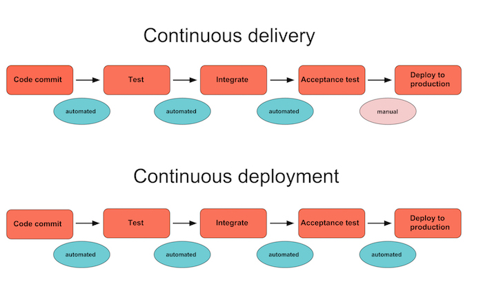
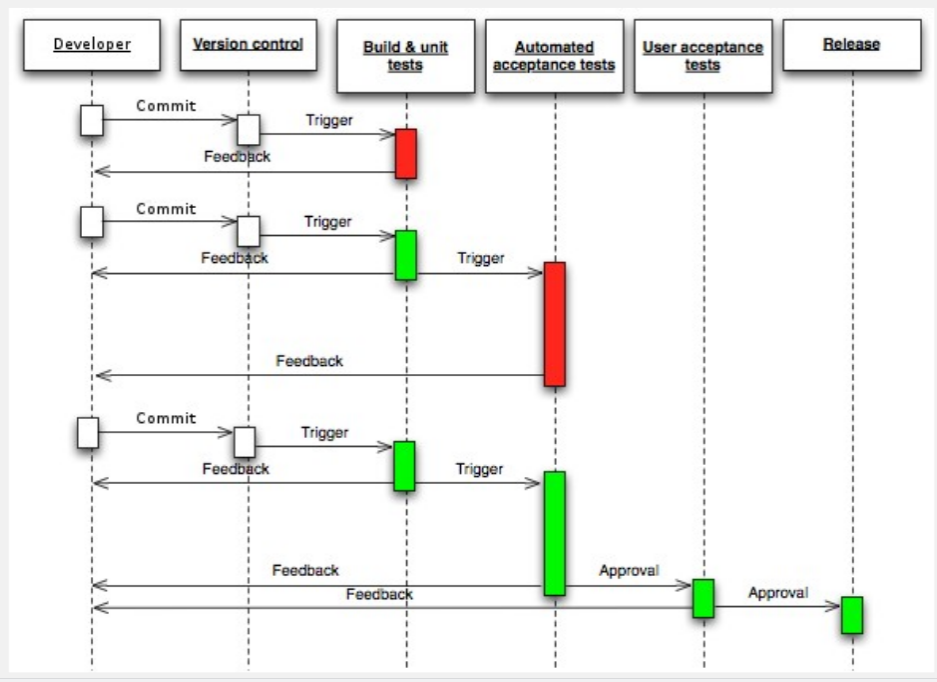

title: Intégration continue avec Jenkins
class: animation-fade
layout: true

<!-- This slide will serve as the base layout for all your slides -->
<!--
.bottom-bar[
  {{title}}
]
-->

---

class: impact

# {{title}}
## *Découvrir le testing et l'automatisation logicielle*

---

# CI/CD

## CI : intégration continue

## CD : Livraison (délivery) et / ou Déploiement continus

---

# CI/CD Principe

## Construire une **infrastructure** *autour du développement logiciel* pour pouvoir:
--

### 1. Accompagner le développeur pour écrire du code fiable et maintenable.
--

### 2. Assembler, documenter et tester des logiciels complexes.
--

### 3. Être agile dans la livraison du logiciel

---

# Comment intégrer et réutiliser des composants logiciels

- Pour cela on sépare le code entre parties spécifiques à l'application et parties génériques.
--

- Les parties génériques sont ce qu'on appelle des librairies (par exemple une librairie pour gérer le cache de donnée d'une application web)
--

- Elles exposent des interfaces bien définies pour la compatibilité (les composants logiciel doivent pouvoir se faire confiance car ils dépendent les uns des autres)
--

- *Problème*: comme faire lorsque vous avez codé un composant logiciel / une vaste librairie pour garantir que vous maintenez la compatibilité ?

---

# La base : gérer finement les versions du code.

- On veut que chaque version du code soit identifiable par un numéro pour savoir exactement de quel **artefact logiciel** on parle.
--

- Le cerveau humain ne peut pas le faire seul (impossible de vérifier manuellement des centaines de fichiers pour chercher si il y a des modifications)
--

- C'est pourquoi on utilise un outil qu'on appelle **gestionnaire de version**. Le principal est bien sur **git**.
--

- Une installatino de CI/CD s'intègre autour d'une **forge logicielle** : une plateforme qui gère des dépôts versionnés de code et encadre un workflow de développement (Cf cours sur git) que doivent suivre les développeurs.

---

# Intégrer des composants logiciels

## ... de façon fiable  et sécurisée

- Le problème du code est qu'il doit évoluer.
--

- Mais la moindre modification dans la réponse d'une fonction peut créer un bug dans un programme utilisant la librairie.
--

- Si votre librairie est très utilisée l'impact peut être énorme (et ça arrive d'introduire un bug qui impacte des milliers de personnes Cf les issues github des gros projets)
--

- Il faut pouvoir contrôler précisément le code développé par une équipe et avoir une façon fiable de vérifier que l'interface (le "contrat" d'usage du composant) est stable.
--

- Le cerveau humain est mal adapté à la vérification systématique de l'interface logicielle ou pire des chemins d'exécution d'un programme.

---

# Réutiliser des composants logiciels

## Les tests automatiques

- Pour automatiser la vérification d'un programme et surtout des libraires pour garantir que la réponse de leurs fonctions est bien ce qu'elle doit être (que le contrat de leur interface est respecté) on ajoute des tests automatiques.
--

- Les tests sont conçus pour utiliser un ou plusieurs composants logiciels toujours de la même façon et vérifier qu'il se comportent comme d'habitude.
--

- Il y a plusieurs types de tests:
  - unitaire (composant par composant, fonction par fonction)
  - d'intégration (plusieurs composants ensembles)
  - fonctionnel (plus ou moins de bout en bout de l'application)
--

- Une installation de CI **intègre** des **tests systématiques dès que le code change**.

---

# 2. Intégrer (assembler) des composants, vérifier leur intégration

## Avoir des interfaces standards entre les composants

Pour construire des logiciels sans perdre de temps ils faut des **interfaces facilement utilisables**:

- Spécification d'interfaces standard en Java (architecture standard JEE ou encore l'interface des composants Spring)
--

- API (Application Programming Interface) REST :  basé sur HTTP universel et simple.
--

---

# 2. Intégrer (assembler) des composants, vérifier leur intégration

## Interfaces **bien documentées**:

- Une usine logicielle doit gérer la construction automatique de la documentation des composants et de leurs interfaces.
--

- Exemple: construire la doc à partir des commentaires docstrings.
--

- Exemple2: Utiliser un constructeur d'API REST comme Swagger qui auto documente l'API.

---

# 2. Intégrer (assembler) des composants, vérifier leur intégration

## Construire facilement des gros logiciels avec des composants hétérogènes.

- On ne peut pas compiler chaque classe d'un projet Java à la main. On va automatiser.

- Mais on ne veut pas devoir mettre à jour le script de construction à chaque fois qu'on déplace un fichier.
--

- Il faut un système intelligent et flexible pour la construction d'un projet logiciel: On appelle ça un **système de build**

---

# 2. Intégrer (assembler) des composants, vérifier leur intégration

## Système de build

- En java il existe deux systèmes de build standards et très proches: **maven** et **gradle** (Cf cours sur les systèmes de build)
--

- Le système de build construit un **artefact** (un .jar en java ou une image docker par exemple) avec tous les éléments de l'application (le code compilé, les images et css par exemple pour une application web, un manifest qui décrit l'application, etc)
--

- Il permet également de déclencher des tests et des taches comme la construction de la documentation.

- Une CI va également se charger d'assembler automatiquement les différents composants de notre application à chaque modification soumise par un développeur.

---

# 2. Intégrer (assembler) des composants, vérifier leur intégration

## Test fonctionnels et d'intégration

- Les tests d'intégration **testent les composants par groupe** ( par exemple vérifie que l'application communique bien avec la base de données ou que Vue et Controlleur fonctionnent ensemble pour toutes les routes ).
--

- Les tests fonctionnels **testent le logiciel du point vue de l'utilisateur** (métier ou final). Ils déclenchent les fonctions soit par l'API publique de l'application soit carrément en "cliquant virtuellement" sur l'interface (Cf Selenium par exemple).
--

- Notre CI déclenche également les tests fonctionnels et d'intégration régulièrement.
--

- Cependant ces tests sont **plus long** que les tests unitaires et seront généralement déclenchés à certaines étapes dans certains environnement (environnement de staging par exemple).

---

# 2. Intégrer (assembler) des composants, vérifier leur intégration

## Qualité logicielle

Malgré les tests il est courant que du code vite fait et mal fait s'accumule au fil des années dans une entreprise. C'est ce qu'on appelle couramment la **dette technique**.
--

- Pour permettre de diagnostiquer et de résorber cette dette on utilise des outils de mesure de la qualité du code. Ex: **Sonarcube**.
--

- Ces outils intégrés dans la CI peuvent même interdire à un développeur de proposer du code ne remplissant pas certains critères.

---

## Sécurité

Il est également courant pour des développeurs en particulier s'ils ne sont pas formés en sécurité informatique d'**introduire certains bugs** dans un logiciel qui peuvent consituter **des failles** (Par exemple des comportements mémoire inadéquats qui permettent d'exploiter l'application)
--

- La revue automatique du code va également permettre de détecter une partie de ces failles grâce à une **analyse de sécurité statique**:
  - teste au maximum tous les chemins d'exécution du programme pour trouver ceux menant à des crash
  - examine l'usage de la mémoire et sa sécurisation pour mettre en valeur les possibilité d'injection.
--

- Ces tests n'éliminent pas les failles de sécurités humaines et dynamiques.

---

#  3. Déploiement/Livraison continue. Être agile dans la livraison du logiciel

- Qu'il soit sur une plateforme en ligne (simple) ou installé sur la machine d'utilisateur (plus complexe), on veut pouvoir contrôler la distribution d'une nouvelle version du logicielle à l'utilisateur.

- Un des principes centraux du DevOps est la livraison voir le déploiement continu.

---

---

#  3. Être agile dans la livraison du logiciel

- La livraison continue implique d'ajouter une nouvelle couche de tests dit d'**acceptance**. Ce sont des tests **fonctionnels*** sur des **parties critiques** de l'application.
--

- S'ils ne passent pas la livraison doit être annulée et le logiciel réexaminé.

---

---

#  3. Être agile dans la livraison du logiciel

- Et..., pour ne pas avoir de surprise lors du déploiement proprement dit:
  - on déploie souvent.
  - de façon automatique.
--

- On utilise toute la panoplie des technologies de fiabilisation d'infrastructure:
  - ansible (infra as code prédictible)
  - docker (boite immutables autonomes)
  - orchestration (gestion automatiques des processus et version du logiciel)

---

# L'Usine logicielle

.col-8[]

---

# Tout cela est fort complexe

... et rarement géré par une seule personne dans la réalité.

## On va commencer par la base

- Git et les versions du code
- Branche et forge logicielle (gitlab)
- Tests unitaires
- Revue de code et qualité

Puis Jenkins va nous permettre de voir l'automatisation de l'usine (en version simple).