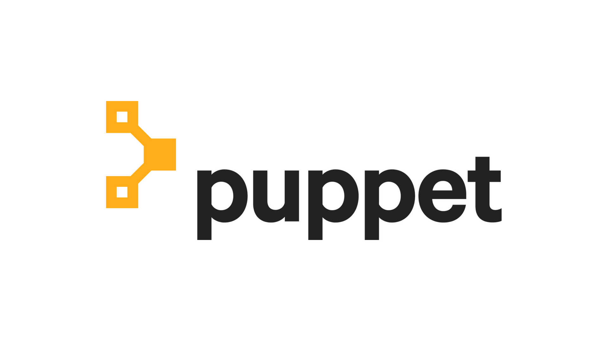
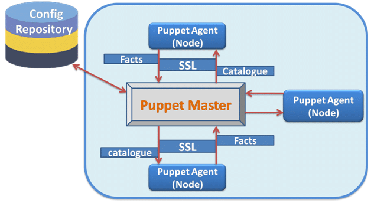

title: Puppet
class: animation-fade
layout: true

<!-- This slide will serve as the base layout for all your slides -->
<!--
.bottom-bar[
  {{title}}
]
-->

---

class: impact

# {{title}}
## *Un gestionnaire de configuration important*

---

# Admin sys = gérer l'état des machines

## Traditionnellement

- Monitoring sur certains signaux de la machine (disque plein, bon fonctionnement apparent des services, etc.)
- Installation à la main des nouvelles machines éventuellement avec des scripts d'assistance.
- Décorrélation entre le monitoring et l'installation
- Installation statique/stable car changer "en largeur" un système est complexe et risqué

---

## Problèmes

- Difficile de connaître l'état
  - généralement pas documenté car pénible et long
  - dérive inévitable du système depuis son état optimal d'installation

- Difficile de faire des infra compliquée et multi-machines de cette façon.

- Difficile d'avancer vite (agrandir, mettre à jour le soft, améliorer la configuration de l'infra)

---

# Gestionnaires de configuration

- Infra as Code (rappel) : on décrit en mode code un état du système comme ça:
  - pas (trop) de dérive de la configuration (la configuration est rectifiée régilièrement)
  - on peut connaître de façon fiable l'état des composants du système
  - on peut travailler en collaboration plus facilement grace à git notamment

- Mais en fait les gestionnaires de configuration sont plus anciens que le concept d'infrastructure as code et que le devops.
  
- Au départ il s'agit surtout de gérer un grand parc de machine sans effort.

---

# Piloter le parc

- Les métaphores qui président à la création de Puppet et Chef : le chef cuisinier et ses commis, tirer les ficelles des marionnettes (puppet).
- Limiter au maximum le nombre de connexion ssh manuelles nécessaires.
- Pouvoir **orchestrer** des opérations qui impliquent plusieurs machines de façon coordonnée.


# Exprimer des opérations complexe plus facilement

- Un langage de haut niveau : éviter les petits détails du bash
- Des Dépendances entre tâches (modules puppet)
- Des abstractions au dessus des outils

---

# Puppet

.col-6[]

.col-6[
- création en 2005
- écrit en partiellement en jruby (java runtime), en C++ et en clojure
- une des plus ancienne et répendue technologie sur le marché
- fonctionne sous Unix en général et aussi Windows
- Open source au début et maintenant open core
- Mauvaise documentation :p
]

---


# Architecture de puppet

- master / agent : centralisé

.col-8[]

---

# Les manifests

- Des fichiers de code déclaratif stockés sur le master.
- `/etc/puppetlabs/code/environments/production/manifests/site.pp`
- Un langage de haut niveau qui décrit des ressources:

```
node 'puppet-node1' {
  package { 'cowsay':
    ensure => present,
  }
}
```


---

# Le démon puppet (agent)

- récupère les `facts` le concernant (quel OS, quelle IP, etc) idem sur Ansible.
- Se connecte au master (nom de domaine `puppet` par défaut) sur le port 8140.
- Le master récupère les facts de l'agent et compile le manifeste.
- L'agent récupère le manifeste compilé et l'applique.
- Chaque ressource décrite dans le manifest est mise dans le bon état.

---

# Mise à jour automatique de l'état des serveurs

- `runinterval=600` par défaut = 10 minutes. 

- Les opérations s'effectue en arrière plan.
- Les modifications manuelles éventuelles sont écrasées.
  - Ça surprend et ça pose des soucis parfois.
- Log ses opérations par défaut dans `/var/log/syslogs`

---

# Lancer manuellement puppet agent

- `puppet agent --test` sur la machine pour le lancer manuellement.

- `--no-daemonize` pour le lancer au premier plan.

- `--noop` pour afficher ce qu'il y a changer sans le faire (compilation du manifeste mais sans appliquer).

---

# SSL pour la sécurité

- La communication master/agent utilise une API REST.

- Le master doit générer son certificat.
- Les agents envoient une requête d'authentification.
- Le master accepte ces requêtes et signe les certificats des agents.
- Les échanges de configuration sont alors authentifiées et chiffrées.

---

# Ansible le concurrent

- L'architecture de puppet est l'architecture traditionnelle des gestionnaires de configuration.
- Nécessite une installation pas si simple pour fonctionner.
- Ansible a attaqué le problème en supprimant l'étape d'installation sur l'infra : agentless.
- Cela entraine que Puppet est plus spécialisé que Ansible
- Puppet est plus rapide grâce à une compilation qui permet d'identifier précisément ce qu'il y a faire
- Ansible relance a chaque fois tout mais ne change pas les choses déjà correctement configurées.