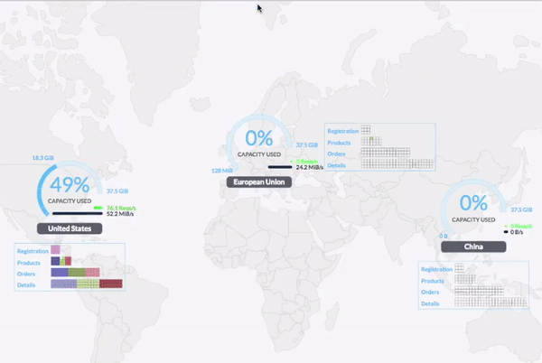

title: Introduction Python et Git
class: animation-fade
layout: true

<!-- This slide will serve as the base layout for all your slides -->
<!--
.bottom-bar[
  {{title}}
]
-->

---

class: impact

# Elastic stack et le logging
*Apprendre à nager dans un océan d'évènements et de texte!*

---

## La stack ELK : Elasticsearch, Logstash, Kibana

- *Elasticsearch* : une base de données pour stocker des **grandes quantités** de **documents texte**
et **chercher** dedans.

- *Logstash* : Un **collecteur de logs** et autre données pour remplir Elasticsearch.

- *Kibana* : Une **interface web** pratique pour **chercher** et **analyser** les données stockées.

---

## La stack ELK : Elasticsearch, Logstash, Kibana

.col-9[]

---

## Pourquoi ELK ? Pourquoi c'est dans le cursus ?

- Gérer une **GRANDE quantité** de logs sur une infrastructure (entre 5 et des centaines de machines)
- Les **explorer** efficacement : un problème difficile vu la quantité (on y reviendra)
- Une brique important pour avoir des applications distribuées avec un déploiement automatisé (#Devops)

---

## En résumé
  
- On va voir trois choses durant ces deux jours qui peuvent résumer l'intérêt d'ELK:
    - Qu'est-ce qu'une **infra distribuée** ? pourquoi ELK c'est du devops ? 
    - **Les logs** : pourquoi? comment ?
    - Découvrir **elasticsearch** et comment **chercher** dans du texte ? *( la partie principale )*

---

## La "hype" elasticsearch

 - Indipensable à de plus en plus d'entreprises qui grossissent : pour augmenter le *contrôle sur les infrastructures*.
 - Un outil très *versatile* et bien fait qui permet de faire de jolis *dashboard d'analyse* et c'est à la mode d'avoir des jolis dashboards
 - Utile pour faire des *big data* : c'est un peu le moteur de l'informatique actuelles. Tous les nouveaus services fonctionnent grace au traitement de données.

---

## Des dashboards !!

.col-9[]

---

# Les évènements d'un système et le logging

## Rappel - pourquoi des Logs ?

---

# Des logs ?

Ça veut dire *journaux (système)* et *bûches*

## Icone originale de Logstash


.col-2[]


---

# Les logs : comprendre ce qui se trame

- Prendre connaissance et analyser les **évènements** d'un système d'un point de vue **opérationnel**.
- Les évènements en informatique sont **invisibles** et presque **instantanés**.
- Les journaux sont la façon la plus simple de contrôler ce qui se passe
  - Des fichiers textes simple avec **une ligne** par **évènement**

---

## Objectifs 1: monitoring

- **Suivre** et **anticiper** le fonctionnement d'un système:
    - **suivre** (et réparer) = zut j'ai une erreur : le service nginx à crashé sur mon infra
    - **anticiper** : le disque dur de cette machine sera bientôt plein il faut que je le change /le vide.
    - **enquêter** : par exemple sur les erreurs rares d'une application

---

## Monitoring comme Nagios ?

- Donc avec la stack elastic on peut faire du monitoring.
- Nagios permet un peu la même chose mais à un niveau plus bas:
    - *Nagios* monitoring plutôt *infrastructure* (réseau, état des OS et système de fichiers)
    - *ELK* monitoring plutôt *application* (est-ce que mon application a des bugs ? répond-t-elle correctement aux requêtes ?)
- Aussi ELK est plus **flexible** et permet l'**analyse statistique**.

---

## Objectif 2: Conserver les traces de ces évènements pour analyse

- **Archiver** pour **analyser** sur la **longue durée** (6 mois à 1 an ?) avec des **graphiques**.

- Exemples : ces derniers mois est-ce que l'application a correctement répondu aux requêtes de mes utilisateurs ?
    - Compter le nombre de *timeout* (application est trop lente ?)
    - Compter le nombre de *requêtes* pour savoir quand sont les pics d'usage dans la journée
    - Connaître la provenance des *requêtes* et le délai de réponse pour savoir
       - si les serveurs sont correctement disposés *géographiquement*.
       - si les requêtes sont "*routées*" (redirigées) vers le bon serveur.

---

## Infra distribuée



---

## Exemples de fichier de logs

- chaque application peut avoir un fichier de log
- ou alors on peut les rassembler dans un le même fichier
- les logs sont dans `/var/log`

Vous en connaissez ?

---

## Exemples de fichier de logs

- *auth.log* : connexion des utilisateurs au système
- *httpd.log* : connexion au serveur web apache
- *mail.log* : (aussi bien envoi que réception donc plusieurs applications)
- *nginx/access.log* : connexion au serveur web nginx

---

## Exemple - les logs à la main

Objectif:
- analyser des logs pour retrouver une information
- être attentif au format des logs

- Se connecter en ```ssh -p 12222 enqueteur@ptych.net```
- en utilisant cat et grep par exemple:
    - Pour savoir qui s'est connecté consultez le fichier /var/log/auth.log
    - Pour connaître le titre du site au fil du temps consultez le fichier /var/log/nginx/access.log
- utilisez `| grep MyWebSite` pour savoir quand le titre a été modifié
- utilisez `| grep` et l'heure pour savoir qui s'est connecté à cette heure ci

---
 

# Bilan 

- Explorer les logs "a la main" c'est pas toujours très pratique.
- Chercher des évènements datés en filtrant (+logrotate) pas très adapté.
- Résoudre un problème nécessite de les interpréter.
- Pour cela on doit chercher et croiser des informations diverses avec un but.

---


## I.2) Le problème avec les logs d'une infrastructure

---

## Décentralisé

- Une infrastructure c'est beaucoup de machines: les logs sont décentralisés à plein d'endroits.
    - Au delà de 3 machines pas question de se logguer sur chacune pour enquêter.

- On veut un endroit centralisé pour tout ranger.

---

## La quantité

- Des millions et des millions de ligne de journaux, ce qui représente potentiellement des *teraoctets* de données. 
- Cette quantité faramineuse de données texte il faut pouvoir:
    - la **stocker** et la **classer**, l'uniformiser (les logs ont pleins de format différents)
    - **chercher** dedans  par date efficacement.
    - **croiser les données**

---

## La stack ELK

.col-9[]

---

## La stack ELK

 - Les **Beats** pour lire les données depuis plusieurs machines
    - **FileBeat** : lire des fichiers de log pour les envoyer à **Logstash**
    - **MetricBeat** : récupérer des donneés d'usage, du CPU, de la mémoire, du nombre de process NGINX
    - etc

- Logstash : récupère les log pour les traiter avant de les envoyer dans Elasticsearch
    - formatter des logs
    - transformer les données avantde les mettres dans

---

### Quelques forces d'Elasticsearch et ELK

 - **Facile à agrandir**: (*elastic*) c'est une application **automatiquement distribuée**.
    - Ajout d'un nouveau noeud, réindexation et hop.
 - **Presque en temps réels** : Les évènements sont disponibles pour la recherche presque instantanément
 - **Recherche très rapide** : sur des gros volumes

---


