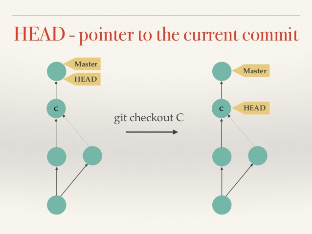

title: Introduction Python et Git
class: animation-fade
layout: true

<!-- This slide will serve as the base layout for all your slides -->
<!--
.bottom-bar[
  {{title}}
]
-->

---

class: impact

# 2. Explorer un dépôt existant

---

# 2. Explorer un dépôt existant

Il s'agit de **télécharger** le dépôt d'un **logiciel** depuis internet et d'explorer son **historique**:
- `git clone <url dépot>` puis `cd <dépôt>` pour aller dans le dossier du dépôt
- `git log` pour voir la liste des commits
- `git checkout <commit num>` pour vous **déplacer** au niveau d'un commit : le code dans le dépôt **change**.
- `git diff <commit_1> <commit_2>` pour voir ce qui a changé entre deux commits.
- Plus pratique : `apt install tig` et `tig` pour explorer chaque commit ou alors utilisez **VSCode** et **GitLens**

---

## L'historique d'un dépôt

---

## Master et les branches d'un dépôt

.col-5[.col-10[]]
--

- Un dépôt git permet d'avoir **plusieurs historiques** en parallèles qu'on appelle des **branches**. Un dépôt git ressemble à un arbre.
--

- La **branche principale** s'appelle **master** dans git (par convention)
--

- Ça commence à devenir compliqué ! On va seulement travailler avec **deux branches** dans les prochains jours ;) :
--

- **master** + **une branche** pour votre travail en cours.

---

## Remonter le temps, déplacer HEAD

- Si git **mémorise les commit successifs** du dépôt c'est en particulier pour:
    - Permettre de "*remonter le temps*", c'est-à-dire **remettre le code** du dépôt **dans un état antérieur**.
    - `git checkout <num_commit>`. L'historique se met également à jour.
    - `git diff` permet à tout moment d'afficher les différences entre deux points du dépôt.

--

- Dans git, **HEAD** désigne un curseur qui indique dans quel état est le dépôt actuellement.
    - par défaut **HEAD** pointe sur le dernier commit de la branche (master s'il n'y en a qu'une).
    - remonter le temps cela signifie déplacer **HEAD**.
    - `git reflog` affiche l'historique des déplacement de **HEAD**.

---

## Déplacer HEAD dans l'historique

.col-6[]

---

## GUI pour explorer l'historique d'un dépôt.

Plusieurs éditeurs de code proposent des interfaces graphique pour:
- naviguer dans les modifications d'un dépôt.
- comparer plusieurs état du dépôt.

C'est le cas de VSCode, en particulier avec les extensions **git graph** et **GitLens**.

D'autres interfaces pratiques et indépendantes de l'éditeur: tig, meld, ...

???

Installer GitLens sur les postes...

---

class: impact

# Explorer un dépôt
# Démonstration

???

Utiliser par exemple le dépôt des exercices. pour revenir au début sur du code que les étudiants connaissent.

---

class: impact

# Deuxième TP
---