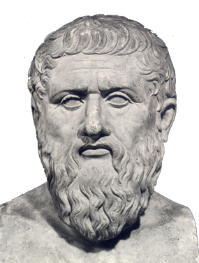

title: Programmer avec Python 
class: animation-fade
layout: true

<!-- This slide will serve as the base layout for all your slides -->
<!--
.bottom-bar[
  {{title}}
]
-->

---

class: impact

# {{title}}
## *From start to autonomy in development*

---

class: impact

(Première chose qu'on dit avec un langage informatique)

# Hello, world!

---

# À propos de moi

.center[

## Elie Gavoty

]

.col-4[
Développeur Python, DevOps
.col-2[ ]
.col-8[

.col-2[ ]
]]

.col-4[.center[
Doctorant en philosophie

]]

.col-4[.center[
Formateur: Python, Ansible, Elasticsearch

]]

---

# À propos de vous

## Parlez moi des épisodes précédents.

---

# Enseigner et apprendre la programmation

## (Mauvaises nouvelles)

- Abstract and Sometimes booooring exercices.
    - *Mais c'est les fondamentaux !*
- Disparité de vitesses d'apprentissage
- Rien ne remplace l'expérience... En fait ça prend des mois d'être à l'aise.

---

# Enseigner et apprendre la programmation

## (Bonnes nouvelles)

- Je suis payé pour répondre à vos questions \o/
- J'ai essayé de faire des exercices pas trop ennuyeux ..?
- Je vais m'adapter aux différentes vitesses.
- DevOps = Devenir architecte du cyberespace

---

# Fonctionnement du cours

Alternances entre explications théoriques sur une notion donnée...

... et mise en application sur des exercices.

---

# Logistique ?

- Les slides de cours sont mis à dispositions sur : **https://eliegavoty.fr/documents** (faites moi penser à les uploader avant de partir)
- Machines virtuelles linux ? Partage Réseau ?
- Évaluation ? QCM de 20 Questions.

---

class: impact

# La programmation

---

class: impact

## L'ordinateur comme outil universel

---

class: impact

# « Informatique »

---

# Informatique

 
 
 
.center[]

---

class: impact

# Machines ain't smart.

# You are !

---

# La programmation : cuisiner de l'information

* Préparer **des outils** et **des ingrédients**
* Donner **des instructions**
* ... parfois en utilisant **des "fonctions"**
    * _« monter des oeufs en neige »_
    * _« cuire à thermostat 6 pendant 20 minutes »_

---

# *Langage* de programmation

## Comme un vrai langage !

1. **Concepts** (mots, verbes, phrases ...)
2. **Grammaire et syntaxe**
3. **Vocabulaire**
4. **Organiser** sa rédaction et ses idées : **structurer** correctement son code et ses données

---

# Python 

.col-3[.col-10[]]
--

- **Versatile !!! ** = un des langages les plus généralistes
--

- "Moyen-niveau"
--

- Syntaxe légère, lisible, facile à prendre en main
--

- Interprété, "scripting" = rapide à mettre en oeuvre mais dépendant d'un logiciel.
--

- Prototypage rapide = la glue du logiciel.
--

- Grande communauté
--

- De plus en plus répandu ! c'est la **mega hype**
--

- DevOps oriented

---

# Python dans la vraie vie

.center[Dropbox]

.center[]

---

# Python dans la vraie vie

.center[Atom]

.center[]

---

# Python dans la vraie vie

.center[Eve online]

.center[]

---

# Python dans la vraie vie

.center[Matplotlib]

.center[]

---

# Python dans la vraie vie

.center[Blender]

.center[]

---

# Python dans la vraie vie

.center[OpenERP / Odoo]

.center[]

---

# Python dans la vraie vie

.center[Tartiflette]

.center[]

---

# Python history

.col-8[
   « ... In December 1989, I was looking for a **"hobby" programming project that would keep me occupied during the week around Christmas**. My office ... would be closed, but I had a home computer, and not much else on my hands.
    
    
   I decided to write an interpreter for the new scripting language I had been thinking about lately: a descendant of ABC that would appeal to Unix/C hackers.
    
    
   I chose Python as a working title for the project, being in a slightly irreverent mood (and a big fan of Monty Python's Flying Circus). »
.right[— Guido van Rossum  .]
]

.col-4[

]

---

class: impact

*Programming mindset*

---

.center[]

---

## .center[La programmation est une pratique *compliquée*]
.col-3[ ].col-6[].col-3[ ]

.col-12[.center[

##  
## Il n'y a rien de génant si vous ne comprenez pas les exercices dès le départ.

]]

---

.center[]

---

# Cassez des trucs !

.center[]

---

# Explorez !

.center[]

---

# Nos outils

- Machine virtuelle (VM) Ubuntu
- Python (3.x)

## Pour coder durant cette formation

On utilise des éditeurs spéciaux pour le code. Ils possèdent des fonctionnalité spécifique comme la vérification syntaxique du code dans de pour trouver les erreurs et 

- **Thonny** : pour débutants, il montre comment s'exécute le code
- **VSCode** : un éditeur puissant et assez simple d'accès qui intègre facilement git

Vous pouvez utilisez **VSCode** également pour d'autres usages (git, ansible, puppel, DevOps en général).

---

# Autres éditeur...

- **Vim** éditeur en console pour ninjas
- **Pycharm** IDE très gros qui fait même le café
- **Emacs** un éditeur de libristes et chercheurs
- **Eclipse** un gros IDE multilanguages
- ... plein d'autres

---

# Exercice d'algorithmique au Tableau
