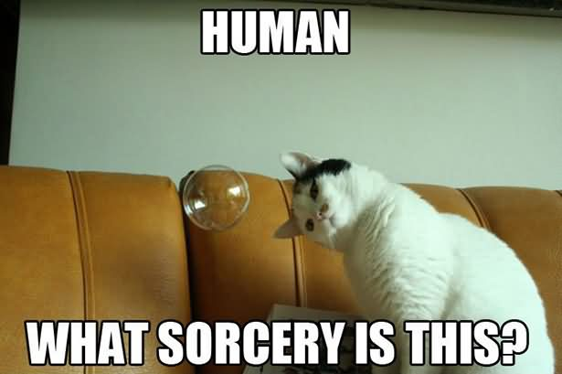

title: Introduction Python et Git
class: animation-fade
layout: true

<!-- This slide will serve as the base layout for all your slides -->
<!--
.bottom-bar[
  {{title}}
]
-->

---

class: impact

### ({{title}})

# 1. Les variables

---

# 1. Les variables

## 1.1. Exemple

```python
message = "Je connais la réponse à l'univers, la vie et le reste"
reponse = 6 * 7

print(message)
print(reponse)
```

---

# 1. Les variables

.center[]

---

# 1. Les variables

## 1.2. Principe

- Les variables sont des abstractions de la mémoire
- Un contenant pour une information : nom + contenu
- Différent du concept mathématique

.center[]

---

# 1. Les variables

## 1.2. Principe

- Les variables sont des abstractions de la mémoire
- Un contenant pour une information : nom + contenu
- Différent du concept mathématique

.center[]

---

# 1. Les variables

## 1.3. Déclaration, utilisation

- En python : déclaration implicite
- Ambiguité : en fonction du contexte, `x` désigne soit le contenant, soit le contenu...

```python
x = 42     # déclare (implicitement) une variable et assigne une valeur
x = 3.14   # ré-assigne la variable avec une autre valeur
y = x + 2  # déclare une autre variable y, à partir du contenu de x
print(y)   # affichage du contenu de y
```

---

# 1. Les variables

## 1.4 Restriction sur le nommage

- Noms des variables : caractères alphanumérique et `_`.
- (Sans commencer par un chiffre)


---

# 1. Les variables

## 1.5. Opérations mathématiques

```python
2 + 3   # Addition
2 - 3   # Soustraction
2 * 3   # Multiplication
2 / 3   # Division
2 % 3   # Modulo
2 ** 3  # Exponentiation
```

---

# 1. Les variables

## 1.6. Types

```python
reponse = 42      # Entier / integer               / int
pi = 3.1415       # Réel                           / float
prenom = "Elie"   # Chaîne de caractère (string)   / str
oui = True        # Booléen                        / bool
```

Connaître le type d'une variable : `type(variable)`

---

# 1. Les variables

## 1.7. Conversion de type

```python
int("3")      -> 3
str(3)        -> "3"
float(3)      -> 3.0
int(3.14)     -> 3
str(3.14)     -> "3.14"
float("3.14") -> 3.14
int(True)     -> 1
int("trois")  -> Erreur
```

---