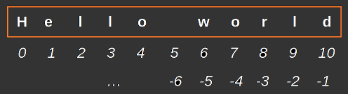

title: Introduction Python et Git
class: animation-fade
layout: true

<!-- This slide will serve as the base layout for all your slides -->
<!--
.bottom-bar[
  {{title}}
]
-->

---

# 3. Chaînes de caractères

.center[]

--

### Longueur

```python
m = "Hello world"
len(m)        # -> 11
```

--

### Extraction


```python
m[:5]    # -> 'Hello'
m[6:8]   # -> 'wo'
m[-3:]   # -> 'rld'
```

---

class: impact

# 3. Chaînes de caractères


---

# 3. Chaînes de caractères

### Multiplication

```python
"a" * 6    # -> "aaaaaa"
```

### Concatenation

```python
"Cette phrase" + " est en deux morceaux."
"J'ai " + str(28) + " ans."
```

### Construction à partir de données, avec `format`

```python
"Je m'appelle {name} et j'ai {age} ans".format(name="Elie", age=28)
"My name is {name} and I am {age} y.o.".format(name="Elie", age=28)
```

---

# 3. Chaînes de caractères

### Substitution

```python
"Hello world".replace("Hello", "Goodbye")   # -> "Goodbye world"
```

### Chaînes sur plusieurs lignes

- `\n` est une syntaxe spéciale faisant référence au caractère "nouvelle ligne"

```python
"Hello\nworld"     # -> Hello <nouvelle ligne> world
```

### Et bien d'autres choses !

c.f. la doc / les internets

---