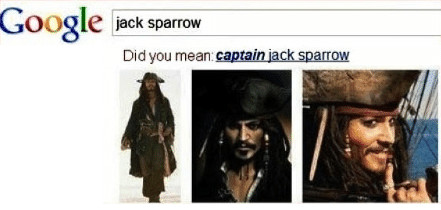

title: Introduction Python et Git
class: animation-fade
layout: true

<!-- This slide will serve as the base layout for all your slides -->
<!--
.bottom-bar[
  {{title}}
]
-->

---

class: impact

# 5. Conditions

---

# 5. Conditions

Gérer des cas pour adapter le fonctionnement du programme

## 5.1 Syntaxe générale

```python
if condition:
    instruction1
    instruction2
elif (autre condition):
    instruction3
elif (encore autre condition):
    instruction4
else:
    instruction5
    instruction6
```

Attention à l'indentation !

---

# 5. Conditions

Tout n'est pas nécessaire, par exemple on peut simplement mettre un `if` :

```python
if condition:
    instruction1
    instruction2
```

---

# 5. Conditions

## 5.2 Exemple

```python
def dire_bonjour(nom):
    if nom == "Jack Sparrow":
        return "Bonjour, *Capitaine* " + nom
    else:
        return "Bonjour, " + nom
```

.center[]

---

# 5. Conditions

## 5.3 Lien avec les booléens

Les conditions comme `nom == "Jack Sparrow"` sont en fait transformées en booléen lorsque la ligne est interprétée.

On aurait pu écrire :

```python
is_jack_sparrow = (nom == "Jack Sparrow")

if is_jack_sparrow:
    [...]
else:
    [...]
```

---

# 5. Conditions

## 5.4 Écrire des conditions

```python
angle == pi      # Égalité
angle != pi      # Différence
angle > pi       # Supérieur
angle >= pi      # Supérieur ou égal
angle < pi       # Inférieur
angle <= pi      # Inférieur ou égal
```

## Combiner des conditions

```python
not (nom == "Jack Sparrow")                # Négation
(nom == "Sparrow") and (prenom == "Jack")  # ET
(nom == "Sparrow") or (prenom == "Jack")   # OU inclusif
```

---

# 5. Conditions

## 5.5 Conditions "avancées"

### Chercher des choses dans des chaînes de caractères

```python
"Jack" in nom           # 'nom' contient 'Jack' ?
nom.startswith("Jack")  # 'nom' commence par 'Jack' ?
nom.endswith("row")     # 'nom' fini par 'row' ?
```

### 'Inline' `if`s

```python
parite = "pair" if n % 2 == 0 else "impair"
```

---