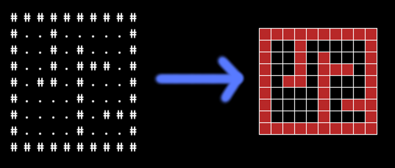
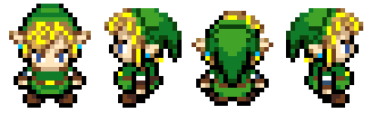

class: impact
# 13. Projet : Construction d'un jeu tile-based

---

Elements de game building / design
----------------------------------

* **Afficher des choses** (écran, images, animations, texte)
* **Gérer les entrées** (clavier, souris, ...)
* Jouer des sons, de la musique
* **Penser l'architecture logicielle du jeu** (structures de données)
* **Penser la mécanique du jeu** (gameplay)
* Penser l'univers du jeu

Ref : http://lanyrd.com/2012/pycon/spbxc/

---

.center[
## Jeux tile-based

# 
]

---

.center[
## Jeux tile-based

# 
]

---

.center[
# Format de la map

# 
]

---

.center[
# Sprites

# 
]

---

# Les grandes étapes

### Le héros

1. Charger le sprite en mémoire
2. Afficher le héros sur l'écran
3. Ajouter une méthode `look` pour faire regarder le héros à
   droite/gauche/haut/bas
4. Ajouter une méthode `move` qui déplace le héros d'une case
5. Mapper les touches du clavier sur `look` et `move`

---

# Les grandes étapes

### La map

1. Lire le fichier ascii de la map vers une liste
2. Afficher la map

### Les collisions

1. Vérifier dans `move` si la case de destination est libre

---