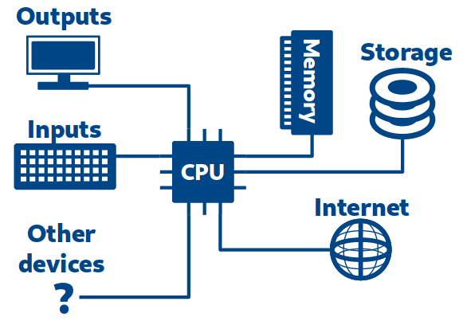
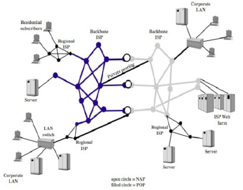
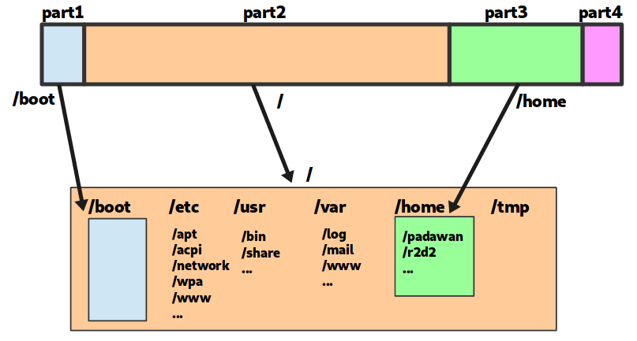
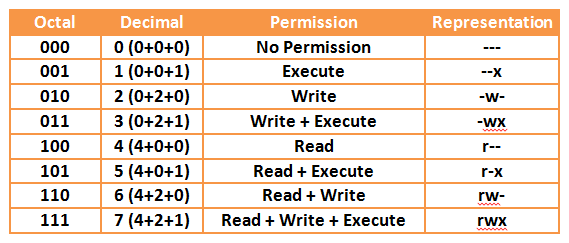

title: Initiation au shell
class: animation-fade
layout: true

<!-- This slide will serve as the base layout for all your slides -->
<!--
.bottom-bar[
  {{title}}
]
-->

---

class: impact

# {{title}}
## *Commander et automatiser Linux*

---

class: impact

#Bonjour à tous !

---

# À propos de vous

- Ou en sommes nous dans le cursus ? 

---

# À propos de moi

.center[

## Elie Gavoty

]
.col-4[
Développeur Backend, DevOps
.col-1[</br>]
.col-10[


.col-1[</br>]
]]

.col-4[.center[
Doctorant en philosophie de la technique


]]

.col-4[.center[
Formateur: Développement et Technologies DevOps


]]

---

# Un peu de logistique

- Les slides de présentation sont disponibles au fur et à mesure à l'adresse [https://eliegavoty.fr/documents]
--

- Les TPs sont accessibles à l'adresse [https://eliegavoty.fr/devops]
--

- Pour exporter les TPs utilisez la fonction d'impression pdf de google chrome.

---

class: impact

# Introduction

---

# Disclaimers

- L'informatique technique, c'est compliqué
- Soyez patient, méthodique, attentifs !

On est là pour apprendre :

- Trompez-vous ! 
- Essayez des choses ! 
- Cassez des trucs !
- Interagissez, posez des questions !

---

class: impact

# 0. Les origines de (GNU/)Linux 

## (ou plus largement de l'informatique contemporaine)

---

# 0. Les origines de Linux

## La préhistoire de l'informatique

- ~1940 : Ordinateurs electromecaniques, premiers ordinateurs programmables
- ~1950 : Transistors
- ~1960 : Circuits intégrés

.center[
...Expansion de l'informatique...
]

---

# 0. Les origines de Linux

## 1970 : PDP-7

.center[

]

---

# 0. Les origines de Linux

## 1970 : UNIX

- Définition d'un 'standard' pour les OS 
- Un multi-utilisateur, multi-tâche
- Design modulaire, simple, élégant, efficace
- Adopté par les universités américaines
- Ouvert (évidemment)
- (Écrit en assembleur)

.center[

]

---

# 0. Les origines de Linux

## 1970 : UNIX

.center[

]

---

# 0. Les origines de Linux

## 1980 : Culture hacker, logiciel libre

- La culture hacker se développe dans les universités
    - Partage des connaisances
    - Transparence, détournement techniques
- R. Stallman fonde le mouvement du logiciel libre et la FSF <small>(Free Software Foundation)</small>
- ... et le projet GNU : un ensemble de programmes libres

.center[


]

---

# 0. Les origines de Linux

## 1990 : Création de Linux

- Linus Torvalds écrit Linux dans son garage

.center[


]

---

# 0. Les origines de Linux

## 1990 : Création de Linux

*I'm doing a (free) operating system (**just a hobby, won't be big and professional like gnu**) for 386(486) AT clones. This has been brewing since april, and is starting to get ready. I'd like any feedback on things people like/dislike in minix, as my OS resembles it somewhat (same physical layout of the file-system (due to practical reasons) among other things).*

*I've currently ported bash(1.08) and gcc(1.40), and things seem to work. This implies that I'll get something practical within a few months, and I'd like to know what features most people would want. Any suggestions are welcome, but I won't promise I'll implement them :-)*

*Linus (torvalds@kruuna.helsinki.fi)*

*PS. [...] It is NOT portable [...] and it probably never will support anything other than AT-harddisks, as that's all I have :-(.
— Linus Torvalds*

---

# 0. Les origines de Linux

## 1990 : Et en fait, Linux se développe...

- Linus Torvalds met Linux sous licence GPL
- Support des processeurs Intel
- Système (kernel + programmes) libre et ouvert
- Compatibles avec de nombreux standard (POSIX, SystemV, BSD)
- Intègre des outils de développement (e.g. compilateurs C)
- Excellent support de TCP/IP
- Création de Debian en 1993

---

# 0. Les origines de Linux

.center[
... L'informatique et Internet se démocratisent ...
]

En très résumé :
- Linux remporte le marché de l'infrastructure (routeur, serveurs, ..)
- Windows remporte le marché des machines de bureau / gaming
- Google remporte le marché des smartphones

---

# 0. Les origines de Linux

## L'informatique contemporaine

.center[

]

.center[


]

---

# 0. Les origines de Linux

## Linux aujourd'hui

- Très présent dans les routeurs, les serveurs et les smartphones
- Indépendant de tout constructeur
- Evolutif mais très stable
- Le système est fait pour être versatile et personnalisable selon son besoin

---

# 0. Les origines de Linux

## Les distributions

Un ensemble de programmes "packagés", préconfigurés, intégré pour un usage ~précis ou suivant une philosophie particulière

- Un noyau (Linux)
- Des programmes (GNU, ...)
- Des pré-configurations
- Un gestionnaire de paquet
- Un (ou des) environnements graphiques (Gnome, KDE, Cinnamon, Mate, ...)
- Une suite de logiciel intégrée avec l'environnement graphique
- Des objectifs / une philosophie


---

# 0. Les origines de Linux

## Les distributions


- **Debian** : réputé très stable, typiquement utilisé pour les serveurs
- **Ubuntu, Mint** : grand public
- **CentOS**, RedHat : pour les besoins des entreprises
- **Archlinux** : un peu plus technicienne, très à jour avec les dernières version des logiciels
- **Kali Linux** : orientée sécurité et pentesting
- **Android** : pour l'embarqué (téléphone, tablette)
- **YunoHost** : auto-hébergement grand-public

---

# 0. Les origines de Linux

## Linux, les environnement

A ne pas confondre avec les environnements.

- Gnome
- Cinnamon, Mate
- KDE
- XFCE, LXDE
- Tiling managers (awesome, i3w, ...)

---

# 0. Les origines de Linux

## Linux, les environnements (Gnome)

.center[

]

---

# 0. Les origines de Linux

## Linux, les environnements (KDE)

.center[

]

---

class: impact

# 1. Rappels sur l'informatique

---

class: impact

# « Informatique »

---

# 1. Rappels sur l'informatique

## Architecture d'un ordinateur

.center[

]

---

# 1. Rappels sur l'informatique

## Le rôle d'un OS

User
Programs
Operating System
Hardware

L'OS :
- sais communiquer avec le hardware pour exploiter les ressources
- créer des abstractions pour les programmes (e.g. fichiers)
- partage le temps de calcul entre les programmes
- s'assure que les opérations demandées sont légales

---

# 1. Rappels sur l'informatique

## Architecture d'Internet

- Décentralisé / distribué / "organique"
- Intelligence à l'extérieur

.center[

]

---

# 1. Rappels sur l'informatique

## Protocoles réseau

- IP : routage des paquets "au mieux"
- TCP : tunnel fiable pour communiquer (IP+accusés de réception)
- Le web : un protocole parmis d'autre pour échanger de l'information, dans un format précis (pages web)
- Le mail : un autre protocole(s) pour échanger de l'information, dans un autre format (les courriers)

Autres protocoles : DNS, SSH, IRC, torrent, ...

---

class: impact

# 2. Prendre en main sa machine et le terminal

---

# 2. Prendre en main sa machine et le terminal

## Se connecter

```

<nom_de_machine> login: votre_login
Password: █        # <<<< le mot de passe ne s'affiche pas du tout quand on le tape !
```

---

# 2. Prendre en main sa machine et le terminal

## Premières commandes

Changez votre mot de passe : 
- Taper `passwd` puis *Entrée* puis suivez les instructions

```
votre_login@machine:~$ passwd
Changing password for votre_login.
(current) UNIX password:
Enter new UNIX password:
Retype new UNIX password:
passwd: password updated successfully
votre_login@machine:~$ █
```

---

.center[

]

---

# 2. Prendre en main sa machine et le terminal

## Premières commandes

- Taper `pwd` puis *Entrée* et observer
- Taper `ls` puis *Entrée* et observer
- Taper `cd /var` puis *Entrée* et observer
- Taper `pwd` puis *Entrée* et observer
- Taper `ls` puis *Entrée* et observer
- Taper `ls -l` puis *Entrée* et observer
- Taper `echo 'Je suis dans la matrice'` puis *Entrée* et observer

---

# 2. Prendre en main sa machine et le terminal

## Discussion

- Nous nous sommes connecté à une machine
- Nous avons eu accès à un terminal
- Le terminal permet de taper des commandes pour interagir "directement" avec l'OS
- Des commandes comme dans "passer commande"
- Certaines affichent des choses, d'autres changent des états

---

class: impact

# 3. La ligne de commande

---

# 3. La ligne de commande

## Structure d'une commande

```
  evince  --fullscreen     presentation.pdf
   |     '------------'    '------------'
   |           |                      |
   v           v                      v
  nom       options              arguments
```

---

# 3. La ligne de commande

## Exemples

Une commande peut être simple :

```
cd
```

ou assez complexe :

```
dnsmasq -x /run/dnsmasq/dnsmasq.pid -u dnsmasq -7 /etc/dnsmasq.d,.dpkg-dist,.dpkg-old,.dpkg-new --local-service
```

---

# 3. La ligne de commande

## `passwd` - Changer son password

---

# 3. La ligne de commande

## `pwd` - Afficher le dossier courant

*Print current working directory*

---

# 3. La ligne de commande

## `cd` - Naviguer dans les dossiers

```
cd  /un/dossier   # Change de dossier courant
cd                # Revient dans le home
cd ..             # Remonte d'un dossier (par exemple /home si on était dans /home/jack)
cd -              # Retourne dans le dossier où on était juste avant
```

N.B : On ne peut pas faire `cd /un/fichier` ! Ça n'a pas de sens !

---

# 3. La ligne de commande

## `ls` - Liste les fichiers d'un dossier

```
ls            # Liste les fichiers du repertoire courant
ls  /usr/bin  # Liste les fichiers du repertoire /usr/bin
ls  -a        # (ou --all) Liste les fichiers (y compris cachés)
ls  -l        # Avec des détails (type, permissions, proprio, date de modif)
ls  -t        # Trie par date de modification
ls  -h        # (ou --human-readable) Tailles lisibles comme '24K' ou '3G'
ls  *.py      # Liste tous les fichiers du repertoire courant qui se finissent par `.py`
```

(on peut combiner les options et arguments)

---

# 3. La ligne de commande

- Utiliser `ls` et `cd`, c'est comme naviguer avec un explorateur de fichier graphique !

- Un bon Jedi est toujours être attentif à :
    - où il est
    - ce qu'il cherche à faire
    - ce qu'il tape
    - ce que la machine renvoie

---

# 3. La ligne de commande

## Nettoyer son terminal

- `clean` efface tout ce qui est affiché dans le terminal
- `reset` permet de réinitialiser le terminal (utile pour certaines situation où le terminal est "cassé")
- `exit` permet de fermer un terminal
- (`logout` est similaire à `exit`)

---

# 3. La ligne de commande

## Obtenir de l'aide sur des commandes

```
man nom_de_commande
```
(navigation avec les fleches, `/mot` pour chercher un mot, `q` pour quitter)


Ou :
```
nom_de_comande --help
```

---

# 3. La ligne de commande

## Annuler / arrêter une commande en cours d'execution

- Si une commande prends trop longtemps, il est possible de l'annuler avec [Ctrl]+C

```
jack@shadow:~$ sleep 30
[...]
[Ctrl]+C
jack@shadow:~$
```

- [Ctrl]+C est à utiliser avec parcimonie ! Interrompre certaines commande peut causer des problèmes...
- (N.B. : [Ctrl]+C / [Ctrl]+V ne fais pas copier/coller dans la console !)

---

# 3. La ligne de commande

## Raccourcis et astuces de ninja

### [Tab]

- [Tab] x1 permet d'autocompléter les noms de commande et les noms de fichier (si pas d'ambiguité)
- [Tab] x2 permet de suggérer les différentes possibilités
- Double-effect pratique : utiliser [Tab] vous permet de valider au fur à mesure que la commande et le fichier existe !

### Historique

- Vous pouvez utiliser ↑ pour retrouver les commandes précédentes
- Ou aussi : `history`

---

class: impact

### Utilisez [Tab] !

---

class: impact

# Utilisez [Tab] !

---

class: impact

# **Utilisez [Tab] !**

---

class: impact

# 4. Le système de fichier 

---

# 4. Le système de fichier

## Généralités

- (En anglais : *filesystem*, abrégé *fs*)
- La façon dont sont organisés et référencé les fichiers
- Une abstraction de la mémoire
- Analogie : une bibliothèque avec seulement les pages des livres dans les étagères
- Le *fs* connait le nom, la taille, l'emplacemenent des différents morceaux, la date de création, ...

---

# 4. Le système de fichier

## Sous UNIX / Linux

"Tout est fichier"

- **fichiers ordinaires** (`-`) : données, configuration, ...
- **répertoire** (directory, `d`) : gérer l'aborescence, ... 
- **spéciaux** : 
    - devices (`c`, `b`) (clavier, souris, disque, ...)
    - sockets (`s`), named pipe (`p`) (communication entre programmes)
    - links (`l`) ('alias' de fichiers, ~comme les raccourcis sous Windows)


---

# 4. Le système de fichier

## Un fichier

- Un inode (numéro unique représentant le fichier)
- *Des* noms (chemins d'accès)
    - Un même fichier peut être à plusieurs endroits en meme temps (hard link)
- Des propriétés
    - Taille
    - Permissions
    - Date de création, modification

---

# 4. Le système de fichier

## Nommage des fichiers

- Noms sensibles à la casse
- (Eviter d'utiliser des espaces)
- Un fichier commençant par `.` est "caché"
- Les extensions de fichier sont purement indicatives : un vrai mp3 peut s'apeller musique.jpg et vice-versa
- Lorsqu'on parle d'un dossier, on l'ecrit plutôt avec un `/` à la fin pour expliciter sa nature

---

# 4. Le système de fichier

## Arborescence de fichier

```
coursLinux/
├── dist/
│   ├── exo.html
│   └── presentation.html
├── exo.md
├── img/
│   ├── sorcery.jpg
│   └── tartiflette.png
├── presentation.md
└── template/
    ├── index.html
    ├── remark.min.js
    └── style.scss
```

---

# 4. Le système de fichier

## Filesystem Hierarchy Standard

- `/` : racine de toute la hierarchie
- `/bin/`, `/sbin/` : programmes essentiels (e.g. `ls`)
- `/etc/` : fichiers de configuration (important pour nous !)
- `/home/` : répertoires personnels des utilisateurs (on travaille généralement ici !)
- `/lib/` : librairies essentielles
- `/root/` : répertoire personnel de `root`
- `/tmp/` : fichiers temporaires
- `/usr/` : progr. et librairies "non-essentielles", doc, données partagées
- `/var/` : fichiers / données variables (e.g. cache, **logs**, boîtes mails)
- etc...

---

# 4. Le système de fichier

## Répertoires personnels

- Tous les utilisateurs ont un répertoire personnel
- Classiquement `/home/<user>/` pour les utilisateurs "normaux"
- Le home de root est `/root/`
- D'autres utilisateurs ont des home particulier (`/var/mail/`, ...)

---

# 4. Le système de fichier

## Filesystem Hierarchy Standard

.center[

]

---

# 4. Le système de fichier

## Designation des fichiers

"Rappel" :
- `.` : désigne le dossier actuel
- `..` : désigne le dossier parent
- `~` : désigne votre home

Un chemin peut être :
- Absolu : `/home/jack/dev/yunohost/script.sh`
- Relatif : `../yunohost/script.sh` (depuis `/home/jack/dev/apps/`)

Un chemin relatif n'a de sens que par rapport à un dossier donné... mais est souvent moins long à écrire


---

.center[

]

---

.center[

]

---

.center[

]

---

.center[

]

---

.center[

]

---

.center[

]

---

.center[

]

---

.center[

]

---

.center[

]

---

.center[

]

---

.center[

]

---

.center[

]

---

# 4. Le système de fichier

## Chemins relatifs

+ d'exemples, tous équivalents (depuis `/home/jack/dev/apps/`)

- `/home/jack/dev/yunohost/script.sh`
- `~/dev/yunohost/script.sh`
- `../yunohost/script.sh`
- `./../yunohost/script.sh`
- `./wordpress/../../yunohost/script.sh`
- `../.././music/.././../barbara/.././jack/dev/ynh-dev/yunohost/script.sh`

---

# 4. Le système de fichier

## Manipuler des fichiers (1/4)

- `ls` : lister les fichiers
- `cat <fichier>` : affiche le contenu d'un fichier dans la console
- `wc -l <fichier>` : compte le nombre de lignes dans un fichier

Exemples :

```bash
ls /usr/share/doc/                       # Liste les fichiers de /usr/share/doc
wc -l /usr/share/doc/nano/nano.html      # 2005 lignes !
```

---

# 4. Le système de fichier

## Manipuler des fichiers (2/4)

- `head <fichier>`, `tail <fichier>` : affiche les quelques premières ou dernières ligne du fichier
- `less <fichier>` : regarder le contenu d'un fichier de manière "interactive"
   - ↑, ↓, ⇑, ⇓ pour se déplacer
   - `/mot` pour chercher un mot
   - `q` pour quitter

```bash
tail -n 30 /usr/share/doc/nano/nano.html # Affiche les 30 dernieres lignes du fichier
less /usr/share/doc/nano/nano.html       # Regarder interactivement le fichier
```

---

# 4. Le système de fichier

## Manipuler des fichiers (3/4)

- `touch <fichier>` : créer un nouveau fichier, et/ou modifie sa date de modification
- `nano <fichier>` : éditer un fichier dans la console
    - (`nano` créera le fichier si besoin)
    - [Ctrl]+X pour enregistrer+quitter
    - [Ctrl]+W pour chercher
    - [Alt]+Y pour activer la coloration syntaxique 
- `vim <fichier>` : alternative à nano
    - plus puissant (mais plus complexe)

---

# 4. Le système de fichier

## Manipuler des fichiers (4/4)

- `cp <source> <destination>` : copier un fichier
- `rm <fichier>` : supprimer un fichier
- `mv <fichier> <destination>` : déplace (ou renomme) un fichier

Exemple

```bash
cp cours.html coursLinux.html  # Créée une copie avec un nom différent
cp cours.html ~/bkp/linux.bkp  # Créée une copie de cours.html dans /home/jack/bkp/
rm cours.html                  # Supprime cours.html
mv coursLinux.html linux.html  # Renomme coursLinux.html en linux.html
mv linux.html ~/archives/      # Déplace linux.html dans ~/archives/
```

---

# 4. Le système de fichier

## Manipuler des dossiers (1/3)

- `pwd` : connaître le dossier de travail actuel
- `cd <dossier>` : se déplacer vers un autre dossier

---

# 4. Le système de fichier

## Manipuler des dossiers (2/3)

- `mkdir <dossier>` : créer un nouveau dossier
- `cp -r <source> <destination>` : copier un dossier et l'intégralité de son contenu

Exemples :

```bash
mkdir ~/dev           # Créé un dossier dev dans /home/jack
cp -r ~/dev ~/dev.bkp # Créé une copie du dossier dev/ qui s'apelle dev.bkp/
cp -r ~/dev /tmp/     # Créé une copie de dev/ et son contenu dans /tmp/
```

---

# 4. Le système de fichier

## Manipuler des dossiers (3/3)

- `mv <dossier> <destination>` : déplace (ou renomme) un dossier
- `rmdir <dossier>` : supprimer un dossier vide
- `rm -r <dossier>` : supprimer un dossier et tout son contenu récursivement

Exemples :

```bash
mv dev.bkp  dev.bkp2   # Renomme le dossier dev.bkp en dev.bkp2
mv dev.bkp2 ~/trash/   # Déplace dev.bkp2 dans le dossier ~/trash/
rm -r ~/trash          # Supprime tout le dossier ~/trash et son contenu
```

---

# 4. Le système de fichier

## Les liens symbolic (symlink)

.center[

]

- `ln -s <cible> <nom_du_lien>`
- Similaire à un "raccourci", le fichier n'est pas vraiment là .. mais comme si
- Supprimer le fichier pointé par le symlink "casse" le lien

---

# 4. Le système de fichier

## Les liens symbolic (symlink)

.center[

]

- Dans ce exemple, le lien a été créé avec 
    - `ln -s ../../../conf/ynh.txt conf.json`
- `conf.json` est "le raccourci" : on peut le supprimer sans problème
- `ynh.txt` est la cible : le supprimer rendra inopérationnel le raccourci

---

# 4. Le système de fichier

## Les points de montage

.center[

]

---

# 4. Le système de fichier

## Notation des patitions

Les disques partitions sous Linux sont généralement dénommées :

- `/dev/sda` (premier disque)
   - `/dev/sda1` (première partition de /dev/sda)
   - `/dev/sda2` (deuxieme partition de /dev/sda)
- `/dev/sdb` (deuxieme disque)
   - `/dev/sdb1` (première partition de /dev/sdb)
   - `/dev/sdb2` (deuxieme partition de /dev/sdb)
   - `/dev/sdb3` (troisieme partition de /dev/sdb)

---

# 4. Le système de fichier

## Outil pour lister les disques, gérer les partions

```bash
$ fdisk -l
Disk /dev/sda: 29.8 GiB, 32017047552 bytes, 62533296 sectors
[...]
Device       Start      End  Sectors  Size Type
/dev/sda1     2048  2099199  2097152    1G Linux filesystem
/dev/sda2  2099200 62524946 60425747 28.8G Linux filesystem
```

```bash
$ fdisk /dev/sda
[editer interactivement le partition de /dev/sda]
```

---

# 4. Le système de fichier

## Outil pour lister les disques, gérer les partions

`parted` et `gparted` (outil graphique très pratique !)

---

# 4. Le système de fichier

## Les points de montage

Une partition ou n'importe quel "bidule de stockage" peut être "monté" dans le système de fichier
- partition d'un disque
- clef usb
- image iso
- stockage distant
- ...

---

# 4. Le système de fichier

## Les points de montage

Les points de montages sont gérés avec `mount`

```bash
$ mkdir /media/usbkey
$ mount /dev/sdb1 /media/usbkey
$ ls /media/usbkey
# [le contenu de la clef usb s'affiche]
```

---

# 4. Le système de fichier

## Les points de montage

On peut "démonter" un element monté avec `umount`

```bash
$ umount /media/usbkey
```

---

# 4. Le système de fichier

## Les points de montage : `/etc/fstab`

`/etc/fstab` décrit les systèmes de fichier montés automatiquement au boot

```text
# <file system>     <mountpoint> <type>  <options>       <dump>  <pass>
UUID=[id tres long] /            ext4    default         0       1
UUID=[id tres long] /home/       ext4    defaults        0       2
```

<small>(historiquement, la premiere colomne contenait `/dev/sdxY`, mais les UUID sont plus robustes)</small>

---

# 4. Le système de fichier

## Les points de montage : outils

Juste `mount` permet aussi de lister les différents points de montage

```bash
$ mount
[...]
/dev/sda1 on /boot type ext4 (rw,noatime,discard,data=ordered)
/dev/sda2 on / type ext4 (rw,noatime,discard,data=ordered)
/dev/sdb1 on /media/usbkey type ntfs (rw,noatime,discard,data=ordered)
```

---

# 4. Le système de fichier

## Les points de montage : outils

Il existe aussi `df` :

```bash
$ df -h
Filesystem      Size  Used Avail Use% Mounted on
dev             2.8G     0  2.8G   0% /dev
run             2.8G  1.1M  2.8G   1% /run
/dev/dm-0        29G   22G  5.0G  82% /
tmpfs           2.8G   22M  2.8G   1% /dev/shm
tmpfs           2.8G  1.9M  2.8G   1% /tmp
/dev/sda1       976M  105M  804M  12% /boot
tmpfs           567M   16K  567M   1% /run/user/1000
/dev/sdb1       3.9G  105M  3.7M   3% /media/usbkey
```

---

# 4. Le système de fichier

## Les points de montage : outils

Et aussi `lsblk` : 

```bash
$ lsblk
NAME          MAJ:MIN RM  SIZE RO TYPE  MOUNTPOINT
sda             8:0    0 29.8G  0 disk
├─sda1          8:1    0    1G  0 part  /boot
└─sda2          8:2    0 28.8G  0 part  /
```

---

class: impact

# 5. Utilisateurs et groupes

---

# 5. Utilisateurs et groupes

## Généralités

- une entité / identité (!= être humain) qui demande des choses au système
- possède des fichiers, peut en créer, modifier, naviguer, ...
- peut lancer des commandes / des processus

---

# 5. Utilisateurs et groupes

## Répertoire des utilisateurs

Classiquement, les utilisateurs sont répertoriés dans `/etc/passwd`

```
jack:x:1000:1000:Zee Aleks:/home/jack:/bin/bash
```

- identifiant / login
- `x` (historique)
- uid (id utilisateur)
- gid (id de groupe)
- commentaire
- répertoire home
- shell de démarrage

---

# 5. Utilisateurs et groupes

## root

- `uid=0`, `gid=0`
- Dieu sur la machine
- **With great power comes great responsabilities**
    - Si un attaquant devient root, l'OS est entièrement compromis (à jamais)


---

# 5. Utilisateurs et groupes

## Passer root (ou changer d'utilisateur)

```bash
su          # Demande à ouvrir un shell en tant que root
su barbara  # Demande à ouvrir un shell en tant que barbara
exit        # Quitter un shell
```

---

# 5. Utilisateurs et groupes

## Sudo

- On peut autoriser les utilisateurs à faire des choses en root en leur donnant les droits 'sudo'

```bash
su -c "ls /root/"   # Executer 'ls /root/' en tant que root (de manière ephemere)
sudo ls /root/      # Meme chose mais avec sudo
sudo whoami         # Renvoie "root"
sudo su             # Ouvrir un shell root via sudo...
```

- Suivant la commande demandée, le mot de passe n'est pas le même...
   - su : mot de passe root
   - sudo : mot de passe utilisateur


---

# 5. Utilisateurs et groupes

## Les groupes

- Chaque user à un groupe associé qui possède le même nom
- Des groupes supplémentaires peuvent être créés
- Ils permettent ensuite de gérer d'accorder des permissions spécifiques

Exemples :
- `students`
- `usb`
- `power`

---

# 5. Utilisateurs et groupes

## Mot de passe

- Autrefois dans `/etc/passwd` (accessibles à tous mais hashés)
- Maintenant dans `/etc/shadow` (accessibles uniquement via root)

```
jack:$6$kncRwIMqSb/2PLv3$x10HgX4iP7ZImBtWRChTyufsG9XSKExHyg7V26sFiPx7htq0VC0VLdUOdGQJBJmN1Rn34LRVAWBdSzvEXdkHY.:0:0:99999:7:::
```

---

# (Parenthèse sur le hashing)

```
$ md5sum coursLinux.html
458aca9098c96dc753c41ab1f145845a
```

...Je change un caractère...

```
$ md5sum coursLinux.html
d1bb5db7736dac454c878976994d6480
```
---

# (Parenthèse sur le hashing)

Hasher un fichier (ou une donnée) c'est la transformer en une chaîne :
- de taille fixe
- qui semble "aléatoire" et chaotique (mais déterministe !)
- qui ne contient plus l'information initiale

Bref : une empreinte caractérisant une information de manière très précise

---

# 5. Utilisateurs et groupes

## Commandes utiles

```bash
whoami                  # Demander qui on est...!
groups                  # Demander dans quel groupe on est
id                      # Lister des infos sur qui on est (uid, gid, ..) 
passwd <user>           # Changer son password (ou celui de quelqu'un si on est root)
who                     # Lister les utilisateurs connectés
useradd <user>          # Créé un utilisateur
userdel <user>          # Supprimer un utilisateur
groupadd <group>        # Ajouter un groupe
usermod -a -G <group> <user>  # Ajouter un utilisateur à un groupe
```

---

class: impact

# 6. Permissions

---

# 6. Permissions

## Généralités

- Chaque fichier a :
    - un utilisateur proprietaire
    - un groupe proprietaire
    - des permissions associés
    - (`root` peut tout faire quoi qu'il arrive)
- Système relativement minimaliste mais suffisant pour pas mal de chose

```
$ ls -l coursLinux.html
-rw-r--r-- 1 jack jack 21460 Sep 28 01:15 coursLinux.html

    ^         ^     ^
    |         |     '- groupe proprio
    |          '- user proprio
    les permissions !
```

---

# 6. Permissions

.center[

]

---

# 6. Permissions

.center[

]


---

# 6. Permissions

## Permissions des **fichiers**

- `r` : lire le fichier
- `w` : écrire dans le fichier
- `x` : executer le fichier

---

# 6. Permissions

## Permissions des **dossiers**

- `r` : lire le contenu du dossier
- `w` : créer / supprimer des fichiers
- `x` : traverser le répertoire

(On peut imager que les permissions d'un dossier soient `r--` ou `--x`)

---

# 6. Permissions

## Gérer les propriétaires

**(Seul root peut faire ces opérations !!)**

```bash
chown <user> <cible>          # Change l'user proprio d'un fichier
chown <user>:<group> <cible>  # Change l'user et groupe proprio d'un fichier
chgrp <group> <cible>         # Change juste le groupe d'un fichier
```

Exemples :

```bash
chown barbara:students coursLinux.md  # "Donne" coursLinux.md à barbara et au groupe students
chown -R barbara /home/jack/dev/      # Change le proprio récursivement !
```

---

# 6. Permissions

## Gérer les permissions

```bash
chmod <changement> <cible>   # Change les permissions d'un fichier
```

Exemples
```bash
chmod u+w   coursLinux.html  # Donne le droit d'ecriture au proprio
chmod g=r   coursLinux.html  # Remplace les permissions du groupe par "juste lecture"
chmod o-rwx coursLinux.html  # Enlève toutes les permissions aux "others"
chmod -R +x ./bin/           # Active le droit d'execution pour tout le monde et pour tous les fichiers dans ./bin/
```

---

# 6. Permissions

## Représentation octale

.center[

]

---

# 6. Permissions

.center[

]

---

# 6. Permissions

## Gérer les permissions .. en octal !

```bash
chmod <permissions> <cible>
```

Exemples
```bash
chmod 700 coursLinux.html  # Fixe les permissions à rwx------
chmod 644 coursLinux.html  # Fixe les permissions à rw-r--r--
chmod 444 coursLinux.html  # Fixe les permissions à r--r--r--
```

---

# 6. Permissions

## Chown vs. chmod

.center[

]

---

# 6. Permissions

Lorsque l'on fait :
```bash
$ /etc/passwd
```

On tente d'executer le fichier !

Obtenir comme réponse

```bash
-bash: /etc/passwd: Permission denied
```

ne signifie pas qu'on a pas les droits de lecture sur le fichier, mais bien que l'on a "juste" pas le droit de l'executer <small>(car ça n'a en fait pas de sens de chercher à l'executer)</small>


---

class: impact

# 7. Processus

---

# 7. Processus

## Généralités

- Un processus est *une instance* d'un programme en cours d'éxécution
- (Un même programme peut tourner plusieurs fois sous la forme de plusieurs processus)

- Un processus utilise des ressources :
    - code qui s'execute dans le CPU, ou en attente en cache/RAM
    - données du processus en cache/RAM
    - autres ressources (port, fichiers ouverts, ...)

- Un processus a des attributs (iidentifiant, proprio, priorité, ...)

---

# 7. Processus

## Execution (1/2)

La machine comprends seulement du code machine ("binaire"). 

Un programme est donc soit :
- compilé (par ex. un programme en C)
- interprété par un autre programme, qui lui est compilé (par ex. un programme en python, interprété par l'interpreteur python)

Rappel : UNIX est multi-tâche, multi-utilisateur
- partage de temps, execution parallèle
- coordonnées par le kernel

---

# 7. Processus

## Execution (2/2)

Un processus est lancé soit : 

- en interactif (depuis un shell / la ligne de commande)
- de manière automatique (tâche programmées, c.f. `at` et jobs cron)
- en tant que daemon/service

En mode interactif, on peut interragir directement avec le processus pendant qu'il s'execute

---

# 7. Processus

## Attributs

- Propriétaire
- PID (processus ID)
- PPID (processus ID du parent !)
- Priorité d'execution
- Commande / programme lancé
- Entrée, sortie

---

# 7. Processus

## Lister les processus et leurs attributs (1/2)

```bash
ps aux            # Liste tous les processus
ps ux -U jack     # Liste tous les processus de l'utilisateur jack
ps -ef --forest   # Liste tous les processus, avec des "arbres de parenté"
pstree            # Affiche un arbre de parenté entre les processus
```

Exemple de `ps -ef --forest`

```
  935   927  0 Sep25 ?      00:00:52  \_ urxvtd
 3839   935  0 Sep26 pts/1  00:00:00      \_ -bash
16076  3839  0 00:49 pts/1  00:00:49      |   \_ vim coursLinux.html
20796   935  0 Sep27 pts/2  00:00:00      \_ -bash
 2203 20796  0 03:10 pts/2  00:00:00      |   \_ ps -ef --forest
13070   935  0 00:27 pts/0  00:00:00      \_ -bash
13081 13070  0 00:27 pts/0  00:00:00          \_ ssh dismorphia -t source getIrc.sh
```

---

# 7. Processus

## Lister les processus et leurs attributs (2/2)

Et aussi :
```bash
top               # Liste les processus actif interactivement
  -> [shift]+M    #    trie en fonction de l'utilisation CPU
  -> [shift]+P    #    trie en fonction de l'utilisation RAM
  -> q            # Quitte
```

---

# 7. Processus

## Priorité des processus (1/2)

- Il est possible de régler la priorité d'execution d'un processus
- "Gentillesse" (*niceness*) entre -20 et 19
    - -20 : priorité la plus élevée
    - 19 : priorité la plus basse
- Seul les process du kernel peuvent être "méchant" 
    - niceness négative, et donc les + prioritaires

---

# 7. Processus

## Priorité des processus (2/2)

```bash
nice -n <niceness> <commande> # Lancer une commande avec une certaine priorité
renice <modif> <PID>       # Modifier la priorité d'un process
```

Exemples :
```bash
# Lancer une création d'archive avec une priorité faible
nice 5 tar -cvzf archive.tar.gz /home/
# Redéfinir la priorité du processus 9182
renice +10 9182
```

---

# 7. Processus

## Gérer les processus interactif

```bash
<commande>            # Lancer une commande de façon classique
<commande> &          # Lancer une commande en arrière plan
[Ctrl]+Z  puis 'bg'   # Passer la commande en cours en arrière-plan
fg                    # Repasser une commande en arrière-plan en avant-plan
jobs                  # Lister les commandes en cours d'execution
```

---

# 7. Processus

## Tuer des processus

```bash
kill <PID>     # Demande gentillement à un processus de finir ce qu'il est en train de faire
kill -9 <PID>  # Tue un processus avec un fusil à pompe
pkill <nom>    # (pareil mais via un nom de programme)
pkill -9 <nom> # (pareil mais via un nom de programme)
```

Exemples

```bash
kill 2831
kill -9 2831
pkill java
pkill -9 java
```

---

# 7. Processus

.center[

]

---

# 7. Processus

## `screen`

`screen` permet de lancer une commande dans un terminal que l'on peut récupérer plus tard

1. On ouvre une session avec `screen`
2. On lance ce que l'on veut dedans
3. On peut sortir de la session avec `<Ctrl>+A` puis `D`.
4. La commande lancée continue à s'executer
5. On peut revenir dans la session plus tard avec `screen -r`

---

class: impact

# 8. Personnaliser son environnement

---

# 8. Personnaliser son environnement

## Variables d'envionnement

Lorsque vous êtes dans un shell, il existe des *variables d'environnement* qui définissent certains comportements.

Par exemple, la variable 'HOME' contient `/home/padawan` et corresponds à l'endroit où `cd` retourne par défaut (si pas de dossier donné en argument)

Autre exemples :

```
SHELL : /bin/bash (généralement)
LANG, LC_ALL, ... : langue utilisée par les messages
USER, USERNAME : nom d'utilisateur
```

---

# 8. Personnaliser son environnement

## Changer une variable d'envionnement

Exemple :

```
HOME=/tmp/ 
```


---

# 8. Personnaliser son environnement

## Lister les variables d'envionnement

`env` permet de lister les variables d'environnement

```
$ env
LC_ALL=en_US.UTF-8
HOME=/home/jack
LC_MONETARY=fr_FR.UTF-8
TERM=rxvt-unicode-256color
[...]
```

---

# 8. Personnaliser son environnement

## Personnaliser l'invite de commande

- La variable `PS1` décrit l'apparence de l'invite de commande !
- Généralement, `PS1` vaut : `\u@\h:\w$`
- `\u` corresponds au nom d'utilisateur
- `\h` corresponds au nom de la machine (host)
- `\w` corresponds au repertoire de travail (working directory)
- `\n` corresponds ... à un retour à la ligne !


---

# 8. Personnaliser son environnement

## Ecrire du texte en couleur

(Syntaxe absolument abominable :'( !)

```
echo -e "\[\033[31m\]Ceci est en rouge\[\033[0m\]"
echo -e "\[\033[32m\]Ceci est en vert\[\033[0m\]"
echo -e "\[\033[33m\]Ceci est en jaune\[\033[0m\]"
echo -e "\[\033[7m\]Ceci est surligné\[\033[0m\]"
echo -e "\[\033[31;7m\]Ceci est surligné en rouge\[\033[0m\]"
```

---

# 8. Personnaliser son environnement

## Définir des aliases

Un alias est un nom "custom" pour une commande et des options

```
alias ll='ls -l'
alias rm='rm -i'
alias ls='ls --color=auto'
```

On peut connaître les alias existants avec juste `alias`

(Mauvaise blague : définir `alias cd='rm -r'` !)

---

# 8. Personnaliser son environnement

## Les fichiers de profil

- Le fichier `~/.bashrc` est lu à chaque lancement de shell
- Il permet de définir des commandes à lancer à ce moment
- Par exemple, des alias à définir ou des variables à changer...
- Pour appliquer les modifications, il faut faire `source ~/.bashrc`

Autres fichiers de profils : `~/.profile` et `/etc/bash_profile`


